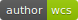

![browser image][browser image]

# md-browse
### A Markdown Viewer


>   
> This module adds a CLI command to enable **quick** reading markdown files in browser per double click and without starting a server.
>  

[](https://badge.fury.io/js/md-browse)
[](https://badge.fury.io/gh/willicommer%2Fmd-browse)
[](https://github.com/WilliCommer)
[](https://lbesson.mit-license.org/)


## Motivation

Often I want to read markdown docus on my disk. But I could not found a simple viewer. There are mostly editors. 
A good viewer is [Shiba][Shiba], but it have a long starting time and for each 
document is there a server running in background.

Because I could not found a simple viewer, I made it by my self and this is the result.

It uses [Showdown][Showdown] to change markdown to HTML and [highlight][highlightjs] for highlighting.
I had to make some coding to change local image links to absolute file:// links. 
Then it uses [opn][opn] to open the result in browser.

I use it on _Windows_ and I hope it runs also on _Apple_ and _Linux_. [Give me response](https://github.com/WilliCommer/md-browse/issues)

I :heart: love node and all the many people that make it grow.


## Installation

Requires [Node.js](https://nodejs.org) and a browser

    npm install md-browse -g
	
## Usage

    mdbrowse <file>
	
In Windows, right click on a file and chose "_open with_". 
Then select the __mdbrowse.cmd__ in your npm folder as application.
You can retrieve this folder with: ```npm bin -g``` if you don't know.
After that you can open markdown files with double click.

If you want to make a HTML file form a markdow file, call in like this

    mdbrowse readme.md -g

this will create a readme.html it the same folder.


## Configuration

You can set some options in __config.js__ file, but it is not necessary.
[Read more][config]


## API

md-browse module exports some [functions][apidoc]

## References
+ [Style Documentation][stylesdochtml]
+ [API Documentation][apidoc]
+ [highlight.js][highlightjs]
+ [highlight CDN][highlightcdn]
+ [opn][opn]
+ [showdown][showdown]


## License

**MIT**

[browser image]: docs/img/browser.png
[highlightjs]: https://highlightjs.org
[highlightcdn]: https://cdnjs.com/libraries/highlight.js
[opn]: https://github.com/sindresorhus/opn
[showdown]: https://github.com/showdownjs/showdown
[Shiba]: https://electronjs.org/apps/shiba

[stylesdochtml]: docs/styles.md
[apidoc]: docs/api.html
[config]: docs/api.html#config

