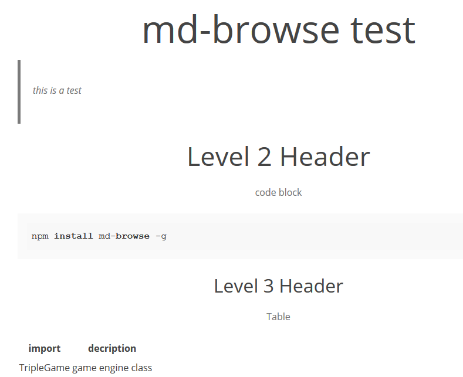
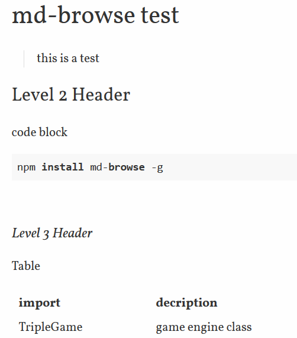
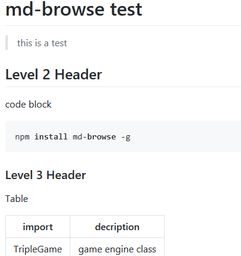
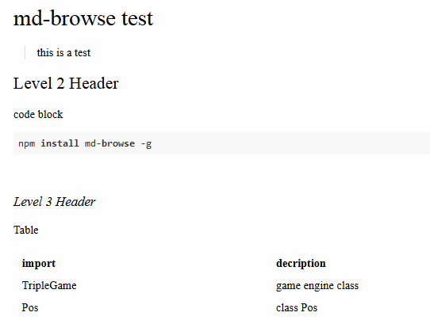
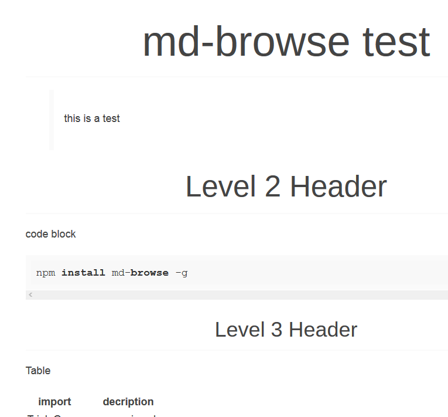
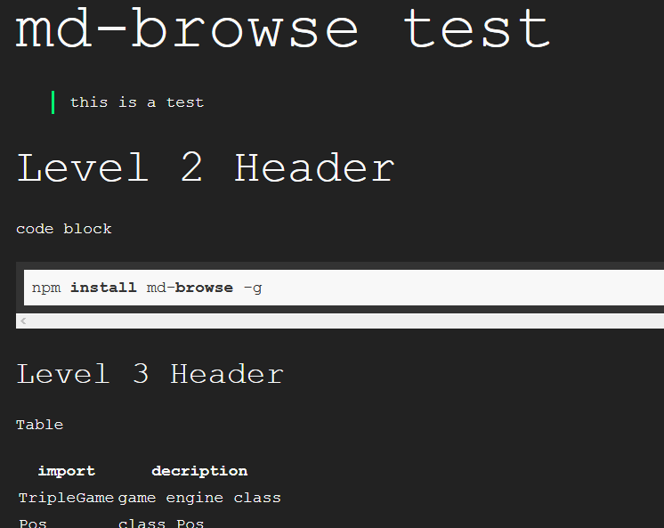
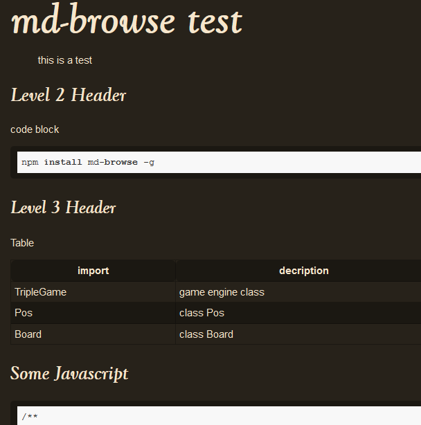
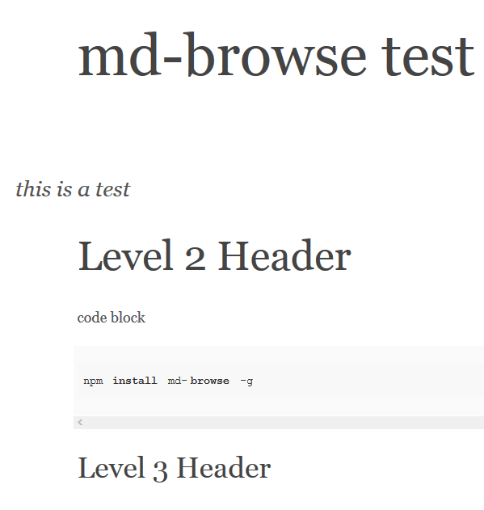

# Style Gallery

## CSS Sources

+ [**air** (John Otander)](https://github.com/markdowncss/modest)
+ [**foghorn** (John Otander)](http://jasonm23.github.io/markdown-css-themes)
+ [**github** (Sindre Sorhus)](https://github.com/sindresorhus/github-markdown-css)
+ [**leghorn** (wcs)](#)
+ [**modest** (John Otander)](https://github.com/markdowncss/modest)
+ [**retro** (John Otander)](https://github.com/markdowncss/retro)
+ [**splendor** (John Otander)](https://github.com/markdowncss/splendor)

### References
+ [highlight styles][highlightjs]
+ [highlight CDN][highlightcdn]

----

## air

----

----

## foghorn

----

----

## github

----

----

## leghorn

----

----

## modest

----

----

## retro

----

----

## screen

----

----

## splendor

----

----

[highlightjs]: https://highlightjs.org
[highlightcdn]: https://cdnjs.com/libraries/highlight.js
